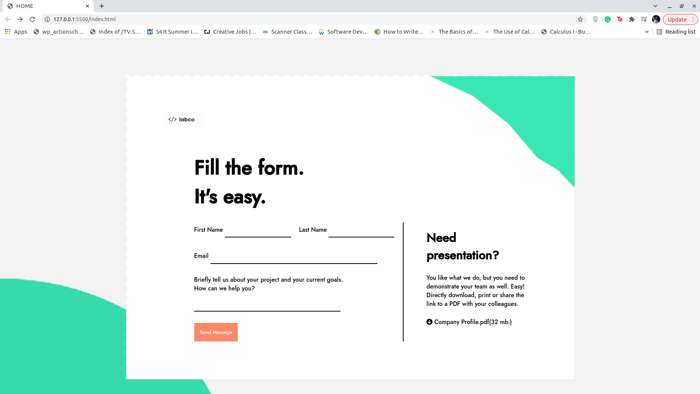

# techupskill_klab

1.This repository contains two questions requested to perform

The first question for redesigning the web page I used the following tools

  1. Vs-code editor: I used the vs-code editor to write the codes and to run them using (golive)
  2. Languages: I used html for the web page structure and css to style it.
  3. font-family: I used the jons font family from googlefonts
  4. Icons: for the icon I used font-awesome
  5. Colors used:
     a.Green: #54e4ac
     b.orange: #ff8b63
     c.Grey: #F3F3F3
     d.white
     
 Limitation: The code submitted isn't responsive it's meant for desktop use only

 

Screenshot of the web page built:  

 
 
2.For the second question I entered the data in a json file and into the mongodb database   and from there I runned querries in mongoshell to give the requested outputs. The Db used will be attached and the collection name is "items"  

For finding the cheap product I used the following query: 

#sorted the array using the price by ascending order and then picked up the first one. 
db.items.aggregate([
    {
        '$sort': {
            'price': 1
        }
    }, {
        '$limit': 1
    }
])
 

The results that came:  

 

The product that will be expensive in the array:  

Code written:  

db.items.aggregate([
    {
        '$sort': {
            'price': -1
        }
    }, {
        '$limit': 1
    }
])

  

Results or output. 

 

The total price of all items. 

the code written 

db.items.aggregate([
    {
        '$group': {
            '_id': 'sum', 
            'totalitems': {
                '$sum': {
                    '$toInt': '$price'
                }
            }
        }
    }
])
 

The results or output
 

